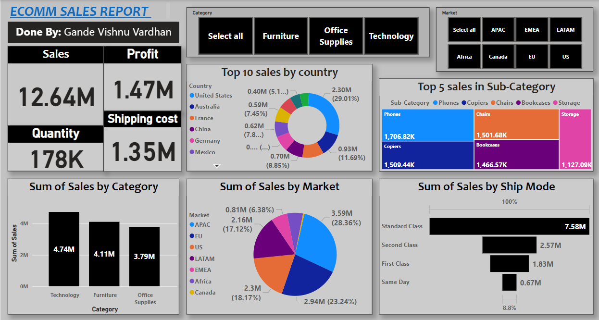

# 📊 Ecomm Sales Dashboard using Power BI

An interactive Power BI dashboard built to analyze and visualize e-commerce sales data, uncovering trends across categories, markets, shipping modes, and countries.

---

## 🚀 Project Overview

This project presents a comprehensive sales dashboard for an e-commerce company. It leverages Power BI to explore sales performance, profit distribution, shipping patterns, and regional preferences. 

The dashboard allows interactive filtering by:
- **Category** (e.g., Furniture, Technology, Office Supplies)
- **Market** (e.g., US, APAC, LATAM, EMEA, Africa, EU, Canada)
- **Sub-Category**
- **Shipping Mode**
- **Country**

---

## 📌 Key Metrics & Outcomes

| Metric            | Value         |
|-------------------|---------------|
| 💰 Total Sales     | **$12.64M**    |
| 📦 Total Quantity  | **178K units** |
| 🚢 Shipping Cost   | **$1.35M**     |
| 💹 Total Profit    | **$1.47M**     |

---

## 📉 Dashboard Features

- ✅ **Dynamic Filters** for Category, Market, and Shipping Mode
- 📊 **Sales Breakdown by Category**:
  - *Technology*: $4.74M
  - *Furniture*: $4.11M
  - *Office Supplies*: $3.79M
- 🌎 **Sales by Market**:
  - *APAC*: $3.59M (28.36%)
  - *US*: $2.30M (18.17%)
  - *EMEA*: $2.16M (17.12%)
- 📍 **Top 10 Countries by Sales**:
  - United States, Australia, France, China, Germany, Mexico, etc.
- 🚚 **Shipping Mode Insights**:
  - *Standard Class*: $7.58M (Most popular)
  - Followed by *Second Class*, *First Class*, and *Same Day*
- 🔍 **Top Performing Sub-Categories**:
  - Phones, Copiers, Chairs, Bookcases, Storage

---

## 📚 Key Business Insights

- 📈 **Technology** is the leading category, contributing **~37.5%** of total sales.
- 🌏 **APAC region** contributes the highest market sales at **$3.59M**.
- 🇺🇸 The **US alone contributes** $2.30M in revenue (1st highest).
- 🪑 **Furniture and Office Supplies** also hold significant shares.
- 🛫 **Standard Class Shipping** is the preferred method, chosen for cost efficiency.
- This data shows that the US, APAC and Technology categories are important for sales.
- 🧾 Profitability remains healthy despite high shipping costs.

---

## 📷 Dashboard Preview

> *(Add an image to the `screenshots/` folder and replace the path below)*

---
